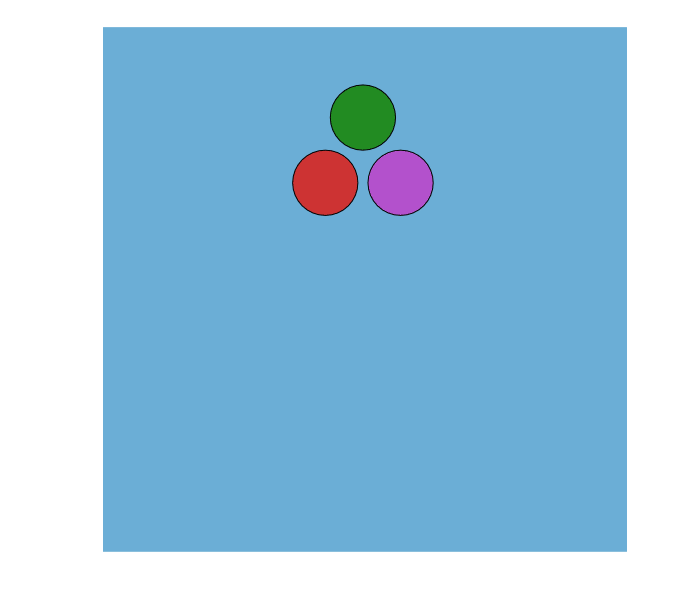

# WaterLily

<!--


 -->
[](https://travis-ci.com/gabrielweymouth/WaterLily.jl)
[](http://codecov.io/github/gabrielweymouth/WaterLily.jl?branch=master)
<!--
[](https://gabrielweymouth.github.io/WaterLily.jl/stable)
[](https://gabrielweymouth.github.io/WaterLily.jl/dev)
-->

Real-time fluid simulator in Julia.


## Overview

WaterLily is an experimental Julia port of [LilyPad](https://github.com/weymouth/lily-pad). The motivation for the port was to take advantage of the larger scientific community in Julia (compared to Processing), but if you want to play around with a much more fully developed solver right now, you should head over to [LilyPad](https://github.com/weymouth/lily-pad).

## Method/capabilities

WaterLily solves the unsteady incompressible 2D or 3D [Navier-Stokes equations](https://en.wikipedia.org/wiki/Navier%E2%80%93Stokes_equations) on a Cartesian grid. The pressure Poisson equation is solved with a [geometric multigrid](https://en.wikipedia.org/wiki/Multigrid_method) method. Solid boundaries are modelled using the [Boundary Data Immersion Method](https://eprints.soton.ac.uk/369635/) (though only the first-order method is currently implemented).

## Examples

The user can set the boundary conditions, the initial velocity field, the fluid viscosity (which determines the [Reynolds number](https://en.wikipedia.org/wiki/Reynolds_number)), and immerse solid obstacles using a signed distance function. These examples and others are found in the [examples](examples).

### Flow over a circle
We define the size of the simulation domain as `n=2^p`x`m=2^(p-1)` cells. The power of two lets the `MultiLevelPoisson` solver quickly determine the pressure at each time step. The circle has radius `R=m/8` and is centered at `[m/2,m/2]` and this is imposed on the flow using a signed distance function. The flow boundary conditions are `[U=1,0]` and Reynolds number is `Re=UR/ν`. 
```julia
using WaterLily
using LinearAlgebra: norm2
function circle(p=7;Re=250)
    # Set physical parameters
    n,m = 2^p,2^(p-1)
    U,R,center = 1., m/8., [m/2,m/2]
    ν=U*R/Re
    @show R,ν

    # Immerse a circle (change for other shapes)
    c = BDIM_coef(n+2,m+2,2) do xy
        norm2(xy .- center) - R  # signed distance function
    end

    # Initialize Simulation object
    u = zeros(n+2,m+2,2)
    a = Flow(u,c,[U,0.],ν=ν)
    b = MultiLevelPoisson(c)
    Simulation(U,R,a,b)
end
sim = circle();
```
Replace the circle's distance function with any other, and now you have the flow around something else... like such as a [donut](ThreeD_donut.jl) or the [Julia logo](TwoD_Julia.jl). Note that the 2D vector fields `c,u` are defined by 3D arrays such that `u[x,y,2]=u₂(x,y)` and that we add a ghost cell on either side so `size(u)=size(c)=(n+2,m+2,2)`.

With the `Simulation` defined, you simulate the flow up to dimensionless time `t_end` by calling `sim_step!(sim::Simulation,t_end)`. You can then access and plot whatever variables you like. For example, you could print the velocity at `I::CartesianIndex` using `println(sim.flow.u[I])` or plot the whole pressure field
```julia
sim = circle();
sim_step!(sim,3)
Using Plots
contour(sim.flow.p')
```
A set of [flow metric functions](src/Metrics.jl) have been implemented and the examples showcase a few of these to make gifs, etc.

### 3D Taylor Green Vortex
You can also simulate a nontrivial initial velocity field by `apply`ing a vector function.
```julia
function TGV_video(p=6,Re=1e5)
    # Define vortex size, velocity, viscosity
    L = 2^p; U = 1; ν = U*L/Re

    # Taylor-Green-Vortex initial velocity field
    u = apply(L+2,L+2,L+2,3) do i,vx
        x,y,z = @. (vx-1.5)*π/L                # scaled coordinates
        i==1 && return -U*sin(x)*cos(y)*cos(z) # u_x
        i==2 && return  U*cos(x)*sin(y)*cos(z) # u_y
        return 0.                              # u_z
    end

    # Initialize simulation
    c = ones(L+2,L+2,L+2,3)  # no immersed solids
    a = Flow(u,c,zeros(3),ν=ν)
    b = MultiLevelPoisson(c)
    Simulation(U,L,a,b)
end
```
Here we define a function of the velocity component `i=1,2` or `3` and the 3D position vector `vx`. We scale the coordinates so the velocity will be zero on the domain boundaries and then check which component is needed and return the correct expression.

## Development goals
 - Immerse obstacles defined by 3D meshes or 2D lines using [GeometryBasics](https://github.com/JuliaGeometry/GeometryBasics.jl).
 - GPU acceleration with [CUDA.jl](https://github.com/JuliaGPU/CUDA.jl)
 - Split multigrid method into its own repository, possibly merging with [AlgebraicMultigrid](https://github.com/JuliaLinearAlgebra/AlgebraicMultigrid.jl) or [IterativeSolvers](https://github.com/JuliaMath/IterativeSolvers.jl).
 - Optimize for [autodiff](https://github.com/JuliaDiff/)
